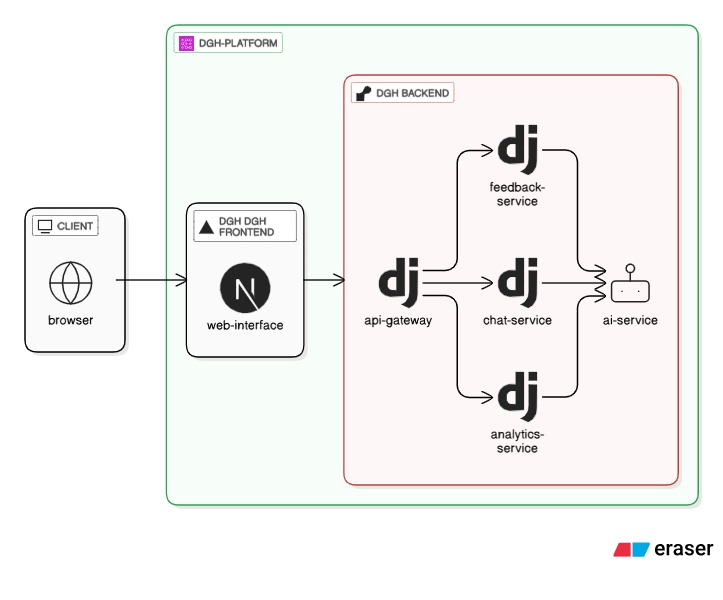
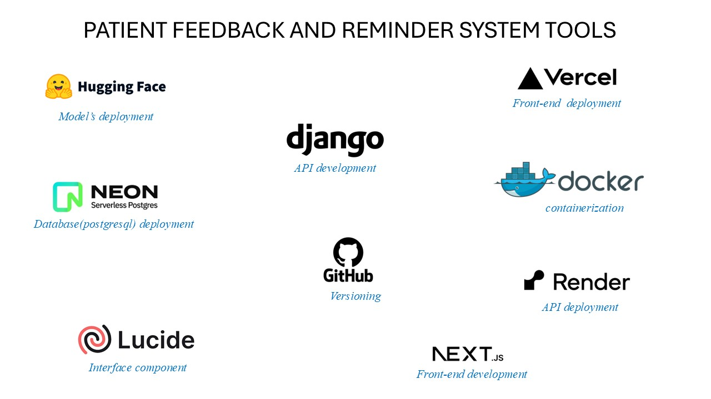

# HIGH5_Code2care
This directory contains the 03 tracks produced without the knowledge of the CODE2CARE datathon organized by the Douala General Hospital

# DGH Platform
### [Patient Feedback and Reminder System (TRACK 1)](dgh-platform/backend/feedback-service)
### [Patient Assistant LLM and support Chatbot (TRACK 2)](dgh-platform/chat-bot)
### [Blood Analysis and management system (TRACK 3)](dgh-platform/backend)

## Overview
This project aims to capture and act on patient feedback while providing automated reminders for appointments and medications. It supports multiple languages (French, English, Duala, Bassa, Ewondo, etc.) and is designed to function even in low-bandwidth conditions (e.g., 2G networks). The system includes a feedback analysis engine, a multilingual patient interface, and a real-time hospital performance dashboard.

---

## Features

### 1. Multilingual Patient Interface
- **Feedback Collection**: Patients can provide feedback via text, voice, or star ratings, regardless of their language.
- **Speech-to-Text**: Integration with Google Speech-to-Text to transcribe voice inputs.
- **Translation**: Translates user interactions from their language to English.
- **Technology**: Built with Next.js for its scalability and performance.

### 2. Feedback Analysis Engine
- **NLP & Machine Learning**: Uses SpaCy and Hugging Face for sentiment analysis (POSITIVE, NEGATIVE, NEUTRAL) and theme extraction (e.g., long wait times).
- **API**: Model served via Django or Fast API.
- **Languages**: Supports English and French.

### 3. Automated Patient Reminder System
- **Multilingual Reminders**: Sends personalized reminders via SMS or calls based on patient preferences.
- **Tracking**: Stores and tracks reminders (time, recipient, language, method) securely on Google Cloud.
- **Goal**: Reduces missed appointments and improves treatment adherence.

### 4. Real-Time Hospital Performance Dashboard
- **Metrics**: Tracks patient satisfaction, common feedback themes, and reminder effectiveness.
- **Visualization**: Built with Next.js and visualization libraries (e.g., D3.js, Chart.js).
- **Filters**: Allows filtering by time period, language, and department.
- **Reporting**: Supports report exports.
- **Authentication**: Role-based access control.

